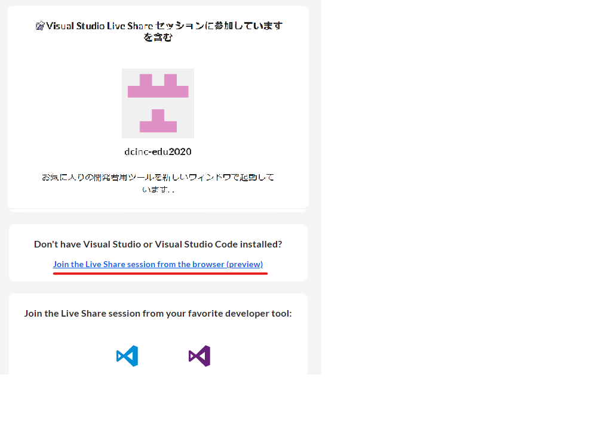

# 開発環境
- [開発環境](#開発環境)
  - [ビルド用PCへ接続し、プログラムや設計書を編集する](#ビルド用pcへ接続しプログラムや設計書を編集する)
  - [ビルド用PC以外からプログラムや設計書を参照する(読み取り専用)](#ビルド用pc以外からプログラムや設計書を参照する読み取り専用)
  - [工夫点をまとめる](#工夫点をまとめる)

## ビルド用PCへ接続し、プログラムや設計書を編集する
1. スタートメニューを開き、「リモートデスクトップ接続」と検索して開く。  
  
1. チームごとに、以下コンピュータに対して接続する。  
  
    |チーム|コンピューター|
    |-|-|
    |1|xx.xx.xx.xx|
    |2|xx.xx.xx.xx|
    |3|xx.xx.xx.xx|
1. 以下ユーザー名とパスワードでログインする。  
  
    |チーム|ユーザー名|パスワード|
    |-|-|-|
    |1|intern1\user1|user1|
    |2|intern2\user2|user2|
    |3|intern3\user3|user3|
1. ここからはチームメンバに画面共有して進めましょう。
1. デスクトップにある「インターン」のリンクを開く。  
    |格納ファイルフォルダ名|内容|
    |-|-|
    |Z:\Internship_program|マイクロマウス用プログラム|
    |Z:\設計書\MicroMouse.iproj|マイクロマウス用プログラムの設計書(Mixinでは無し)|
    |Z:\マイクロマウス開発手順書.pdf|プログラムのビルド手順書|
    |Z:\迷路走行プログラムの手引き.pdf|開発プログラム作成の手引き書＋ベースプログラムの構造|
1. 「マイクロマウス開発手順書.pdf」を開く
1. 手順書を参考に、プログラムのビルドできる(p7まで実施できる)ことを確認し、プログラム開発に入る。
* (参考)PCには以下ツールが入っています。
  * マイクロマウス用コンパイラ(CS+)・・・マイクロマウス用プログラムのコンパイラ
  * 次世代設計ツール NextDesign (デンソークリエイト製ツール！)・・・設計書のエディタ

## ビルド用PC以外からプログラムや設計書を参照する(読み取り専用)
* 開発手順書
  * https://github.com/dcinc-edu2020/intern2020/blob/master/doc/build/マイクロマウス開発手順書.pdf
* 迷路走行プログラムの手引き
  * https://github.com/dcinc-edu2020/intern2020/blob/master/doc/build/迷路走行プログラムの手引き.pdf
* 設計書（※Mixinでは関係なし）
  * https://dcinc-edu2020.github.io/intern2020/doc/design/index.html
* ベースコード
  * https://github.com/dcinc-edu2020/intern2020/tree/master/program
* ベースコード(ブラウザ上でIDEっぽく見る)
  1. 以下URLにアクセス  
    https://prod.liveshare.vsengsaas.visualstudio.com/join?9983462D95C53AF9BE08845A463E66D2B9AC
  1. 「Join the Live Share session from the browser (preview)」をクリック  
    ※VisualStudio+LiveShareがインストールしてある人はそちらで開いてもOK  
    
  1. 画面右下に出る「Continue as anonymous」をクリック  
    
  1. 適宜ユーザ名(Guset UserのままでもOK)を入れてEnterキー  
    

## 工夫点をまとめる
* Googleスライドで1ページ作成  
  スライドのURLはZoomのチャットで連絡します。

