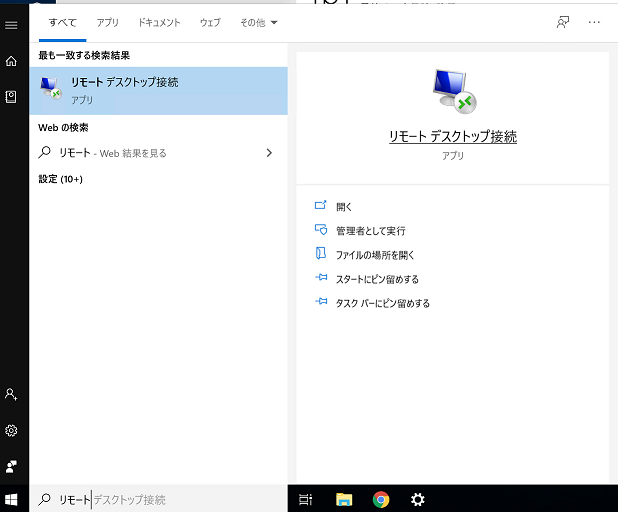

# 開発環境

## ビルド用PCへ接続し、プログラムや設計書を編集する
1. スタートメニューを開き、「リモートデスクトップ接続」と検索して開く。  
  
1. チームごとに、以下コンピュータに対して接続し、ユーザー名とパスワードでログインする。
    |チーム|コンピューター|ユーザー名|パスワード|
    |-|-|-|-|
    |A|20.48.52.137:3389|user1|user1|
    |B|20.48.108.136:3389|user2|user2|
    |C|20.194.232.49:3389|user3|user3|

1. それぞれ以下をダブルクリックで開き、編集する
    |編集対象|格納パス|
    |-|-|
    |プログラム|Z:\xxx|
    |設計書|Z:\MicroMouse.iproj|

* (参考)PCには以下ツールが入っています。
  * マイクロマウス用コンパイラ(CS+)
  * 次世代設計ツール NextDesign (デンソークリエイト製のツール！)

## ビルド用PC以外からプログラムや設計書を参照する(読み取り専用)
* 設計書
  1. 以下URLにアクセス  
    https://dcinc-edu2020.github.io/intern2020/design/index.html

* コード(ベース)
  1. 以下URLにアクセス  
    http://xxx
  1. 「Join the Live Share session from the browser (preview)」をクリック  
    ※VisualStudio+LiveShareがインストールしてある人はそちらで開いてもOK  
    
  1. 画面右下に出る「Continue as anonymous」をクリック
    
  1. 適宜ユーザ名(Guset UserのままでもOK)を入れてEnterキー
    

  * (LiveShareが止まった時の予備)以下URLにアクセス  
    https://github.com/dcinc-edu2020/intern2020/tree/master/program
